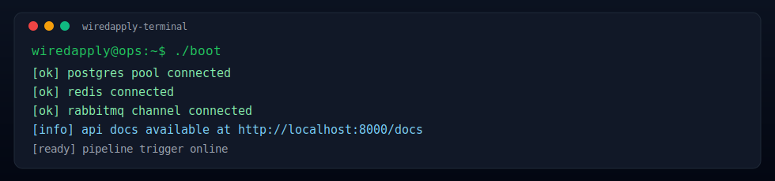
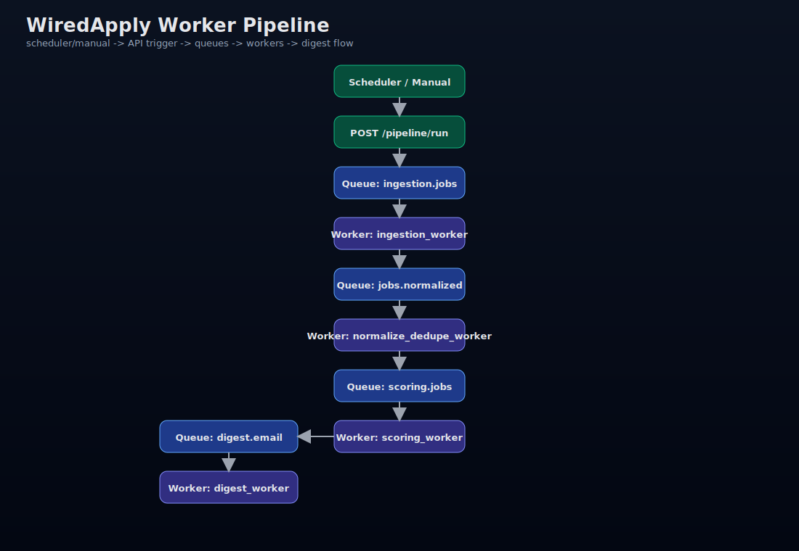
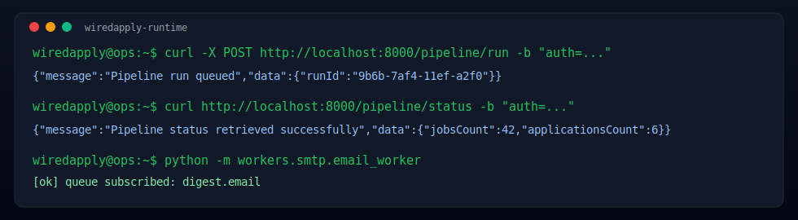

<p align="center">
  
</p>

<p align="center">
  
  
  
  
  
  
  
</p>

<p align="center">
  
</p>

<p align="center">
  
</p>

<p align="center">
  
</p>

<p align="center">
  
</p>

<p align="center"><strong>PT-BR</strong> | <strong>EN</strong></p>

---

## PT-BR

### Visao geral

WiredApply e uma API open-source para transformar busca de vagas em operacao diaria.

- ingestao de vagas
- ranking por score
- candidaturas assistidas
- feedback do usuario para melhorar priorizacao
- digest diario

A proposta e simples: menos ruido, mais sinal, com controle humano no ponto critico.

### Quick Start

```bash
python -m venv .venv
.venv\Scripts\activate
pip install -r requirements.txt
copy .env.example .env
psql -U postgres -d your_db -f schema.sql
uvicorn main:app --host 0.0.0.0 --port 8000 --reload
```

Docs:
- `http://localhost:8000/docs`
- `http://localhost:8000/openapi.json`

### Docker

```bash
copy .env.example .env
docker compose up --build -d
```

Com isso, API + PostgreSQL + Redis + RabbitMQ sobem juntos.
O `schema.sql` e aplicado automaticamente no primeiro boot do Postgres.

Para subir tambem os workers da pipeline:

```bash
docker compose --profile workers up --build -d
```

Para derrubar tudo:

```bash
docker compose down
```

Smoke test rapido da pipeline (PowerShell):

```powershell
powershell -ExecutionPolicy Bypass -File .\pipeline_smoke_test.ps1
```

Worker SMTP (opcional):

```bash
python -m workers.smtp.email_worker
```

### Mapa rapido da API

| Modulo | Endpoint base | Papel |
|---|---|---|
| Auth | `/auth/*` | sessao, login e reset |
| Users | `/users/*` | perfil e conta |
| Pipeline | `/pipeline/*` | trigger e status do fluxo |
| Jobs | `/jobs/*` | CRUD de vagas |
| Applications | `/applications/*` | ciclo de candidatura |
| Feedback | `/feedback/*` | sinal para aprendizado |
| Digest | `/digest/*` | resumo diario |

### Pipeline de Workers

<p align="center">
  
</p>

Detalhe por etapa:

| Queue | Worker consumidor | Saida principal |
|---|---|---|
| `ingestion.jobs` | `ingestion_worker` | vagas coletadas para `jobs.normalized` |
| `jobs.normalized` | `normalize_dedupe_worker` | vagas limpas + dedupe + envio para `scoring.jobs` |
| `scoring.jobs` | `scoring_worker` | score salvo + shortlist em `shortlist.apply` |
| `shortlist.apply` | `apply_worker` | atualiza `applications` |
| `retry.apply` | `retry_worker` | reprocessa falha tecnica com backoff |
| `digest.email` | `digest_worker` | prepara resumo diario para envio |

Pipeline status (MVP target):

<p>
  
  
  
  
  
  
</p>

### Snapshot de terminal

<p align="center">
  
</p>

### Roadmap curto

- applications CRUD completo com ownership estrito
- feedback CRUD com ajuste adaptativo de pesos
- ranking diario por score
- digest diario com envio por fila
- workers com idempotencia e retry

### Contribuindo

```text
1) Fork
2) Branch: feat/nome-curto
3) Commits pequenos e objetivos
4) Pull Request com contexto claro
```

### Seguranca

- nao versione segredos
- use `.env`
- valide ownership (`user_id`) em toda query de usuario
- mantenha confirmacao humana para submit final no MVP

### Licenca

MIT. Veja `LICENSE`.

---

## EN

### Overview

WiredApply is an open-source API for daily job-search operations.

- job ingestion
- score-based ranking
- assisted applications
- feedback-driven tuning
- digest delivery

Core idea: less noise, more signal, with human control at the final submit step.

### Quick Start

```bash
python -m venv .venv
.venv\Scripts\activate
pip install -r requirements.txt
copy .env.example .env
psql -U postgres -d your_db -f schema.sql
uvicorn main:app --host 0.0.0.0 --port 8000 --reload
```

Docs:
- `http://localhost:8000/docs`
- `http://localhost:8000/openapi.json`

### Docker

```bash
copy .env.example .env
docker compose up --build -d
```

This starts API + PostgreSQL + Redis + RabbitMQ together.
`schema.sql` is applied automatically on the first Postgres boot.

To start the full worker chain too:

```bash
docker compose --profile workers up --build -d
```

To stop everything:

```bash
docker compose down
```

Quick pipeline smoke test (PowerShell):

```powershell
powershell -ExecutionPolicy Bypass -File .\pipeline_smoke_test.ps1
```

SMTP worker (optional):

```bash
python -m workers.smtp.email_worker
```

### API map

| Module | Base endpoint | Role |
|---|---|---|
| Auth | `/auth/*` | session, login, reset |
| Users | `/users/*` | account and profile |
| Pipeline | `/pipeline/*` | trigger and status |
| Jobs | `/jobs/*` | jobs CRUD |
| Applications | `/applications/*` | application lifecycle |
| Feedback | `/feedback/*` | learning signal |
| Digest | `/digest/*` | daily summary |

### Workers pipeline

<p align="center">
  
</p>

### Runtime snapshot

<p align="center">
  
</p>

### Short roadmap

- full applications CRUD with strict ownership checks
- feedback CRUD with adaptive weight updates
- daily ranking by score
- queue-based digest delivery
- idempotent workers with retry

### Contributing

```text
1) Fork
2) Branch: feat/short-name
3) Small, focused commits
4) Pull Request with clear context
```

### Security

- do not commit secrets
- use `.env`
- enforce ownership (`user_id`) in every user query
- keep human confirmation for final submit in MVP

### License

MIT. See `LICENSE`.
